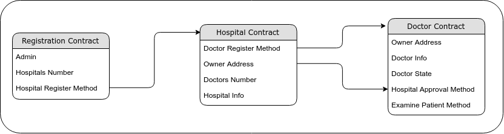

HealthCare Smart Contract
==========================

Overview 
---------

The HealthCare scenario shows an example of how an application can have more than one workflow, how one contract can deploy another contract and how to simplify a complex application logic by dividing the logic into several contracts.
The HealthCare application has three workflows.  The first workflow lets Hospital register in the HealthCare application and create a new smart contract for the Hospital.  The second workflow lets the Doctors request to join a Hospital which will create a new Contract for the Doctor. The Hospital can accept or reject Doctors requests to join the Hospital. In case of acceptance, the Doctor contract will be linked with the Hospital contract.  The third workflow lets the Doctor interact with the Patient and issue a medical record for Patient.

Application Roles 
------------------

| Name       | Description                                                |
|------------|------------------------------------------------------------|
| Admin      | A person who is responsible for Hospital registration.    |
| Hospital   | A person who is an owner of a Hospital Contract in the application. and can accept doctors to be a part of the hospital|
| Doctor     | A person who is an owner of a Doctor Contract in the application. and can interact with patients after being approved by the Hospital|
| Patient    | A person who can interact with Doctor contract             |

Doctor Workflow States 
------------------------------

| Name          | Description                                                                    |
|---------------|--------------------------------------------------------------------------------|
| Submited      | Indicates that the doctor request is not processed by the Hospital yet.        |
| Approved      | Indicates that the doctor request is accepted by the Hospital.                 |
| Rejected      | Indicates that the doctor request is rejected by the Hospital.                 |
| Banned        | Indicates that the doctor is banned from the Hospital.                         |

Workflow Details
----------------

An instance of the HealthCare application is created, the contract can then accept Hospitals registration, which will deploy a new contract for each Hospital with Hospital Owner saved to the contract for later use.

Doctors can view available Hospitals from the registration contract Logs, and request to join a Hospital, which will generate a new contract for the Doctor with a `Submited` state and fires an event to the Hospital to Handle the Doctor request.

Hospital Owner can view Doctors registrations from the Hospital contract Logs, and approve/reject/ban the Doctor from the Hospital, which will update the Doctor contract state to `Approved`, `Rejected` or `Banned`.

After Doctor's Contract state is set to Approved, the Doctor can interact with Patients directly and issue medical records for them.

Application Files
-----------------

[healthchain.cs](./healthchain.cs) - This file contains the code for Workflow 1, 2 and 3 mentioned above. 

References
-----------------
[Azure Workbench Bazaar Item Listing Example](https://github.com/Azure-Samples/blockchain/tree/master/blockchain-workbench/application-and-smart-contract-samples/bazaar-item-listing)

[Stratis Bazaar Smart Contract Samples Example](https://github.com/stratisproject/StratisSmartContractsSamples/tree/master/src/BazaarItemListingContract)
